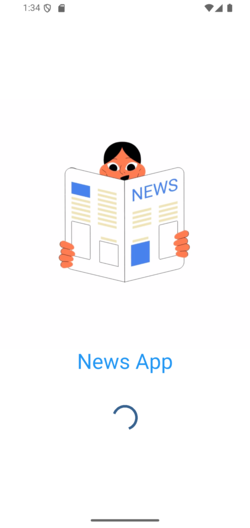
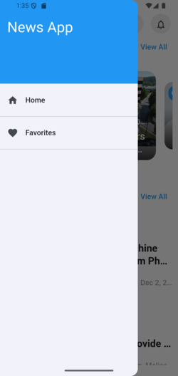
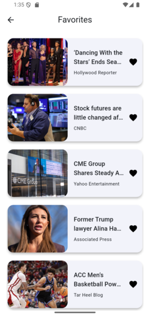

# News Application

A modern, cross-platform news application built with Flutter. It provides users with the latest news articles, browsable by categories, with a clean, animated, and intuitive user interface.

### Technologies Used

- **Framework:** [Flutter](https://flutter.dev/)
- **Language:** [Dart](https://dart.dev/)
- **State Management:** [flutter_bloc](https://pub.dev/packages/flutter_bloc)
- **HTTP Client:** [Dio](https://pub.dev/packages/dio)
- **Navigation:** (onGenerateRoute)
- **Local Storage:** [Hive](https://pub.dev/packages/hive) & [shared_preferences](https://pub.dev/packages/shared_preferences)
- **Animations:** [Lottie](https://pub.dev/packages/lottie), Implicit & Hero Animations
- **Environment Variables:** [flutter_dotenv](https://pub.dev/packages/flutter_dotenv)

## Features

Here are some of the key features detected from the project's dependencies and structure:

- **Animated Splash Screen:** A visually appealing and smooth animated splash screen that engages the user right from the start, using implicit animations for a fluid entry into the app.
- **Top Headlines Carousel:** A dynamic `CarouselSlider` on the home screen to showcase breaking or featured news.
- **Categorized News:** Browse articles by categories such as Business, Technology, Sports, Health, and more.
- **Search Functionality:** Easily search for specific news articles or topics.
- **Smooth Hero Animations:** Seamless transitions when navigating from a news list to the article details page. The article's image animates smoothly into place, providing a delightful user experience.
- **Video Content:** An integrated `video_player` to watch news clips and video reports directly within the app.
- **Efficient Image Caching:** Uses `cached_network_image` to cache article images, reducing network usage and load times.
- **Skeleton Loading UI:** Implements `skeletonizer` to show elegant loading skeletons while content is being fetched, improving perceived performance.
- **Lottie Animations:** Utilizes `lottie` for high-quality, complex animations, possibly for loading indicators or "no data" states.
- **Offline Caching:** Leverages `Hive` for local database storage, which can be used to cache articles for offline reading.
- **Cross-Platform:** Single codebase for both Android and iOS.

## Project Structure

The project follows a standard Flutter application structure.

```
news_application/
├── android/              # Android-specific host project
├── build/                # Build output files (ignored by Git)
├── ios/                  # iOS-specific host project
├── lib/                  # Main application source code (Dart)
│   ├── main.dart         # Application entry point
│   ├── models/           # Data models (e.g., Article, Source)
│   ├── services/         # Logic for fetching data from APIs
│   ├── utils/            # Utility functions and constants
│   └── widgets/          # Reusable UI components
├── test/                 # Unit and widget tests
├── windows/              # Windows-specific host project
└── pubspec.yaml          # Project dependencies and metadata
```

- `lib/`: Contains all the Dart code for the Flutter application. This is where the main logic, UI, and business rules reside.
- `android/`, `ios/`, `windows/`: These folders contain the native host project for each respective platform.
- `test/`: All automated tests, including unit tests and widget tests.
- `pubspec.yaml`: The project's configuration file, used to manage dependencies, assets, and other metadata.

## Installation & Setup

Follow these steps to get the project up and running on your local machine.

**1. Prerequisites:**

Make sure you have the Flutter SDK installed on your machine. For more information, see the official Flutter documentation.

**2. Clone the Repository:**

```sh
git clone https://github.com/your-username/news_application.git
cd news_application
```

**3. Install Dependencies:**

Run the following command to fetch all the required packages.

```sh
flutter pub get
```

**4. Run the Application:**

Connect a device or start an emulator, then run the app with the following command:

```sh
flutter run
```

### Build Commands

- **Build an Android APK:**

  ```sh
  flutter build apk --release
  ```

- **Build an Android App Bundle:**

  ```sh
  flutter build appbundle --release
  ```

- **Build for iOS:**
  ```sh
  flutter build ios --release
  ```

## Screenshots

:

📸 Screenshots

<div style="display: flex; flex-wrap: wrap; gap: 10px;">      </div>
## Usage

Once the application is running, you can:

1.  Scroll through the list of top headlines on the main screen.
2.  Tap on a news category to filter the articles.
3.  Use the search bar to find news about a specific topic.
4.  Tap on any article card to open the full detail view and read the content.

## Contributing

Contributions are welcome! If you have suggestions for improving the app, please feel free to open an issue or submit a pull request.

1.  Fork the Project
2.  Create your Feature Branch (`git checkout -b feature/AmazingFeature`)
3.  Commit your Changes (`git commit -m 'Add some AmazingFeature'`)
4.  Push to the Branch (`git push origin feature/AmazingFeature`)
5.  Open a Pull Request

## License

This project is licensed under the MIT License. See the `LICENSE` file for more information.

```
MIT License

Copyright (c) [Year] [Your Name]

Permission is hereby granted, free of charge, to any person obtaining a copy
of this software and associated documentation files (the "Software"), to deal
in the Software without restriction, including without limitation the rights
to use, copy, modify, merge, publish, distribute, sublicense, and/or sell
copies of the Software, and to permit persons to whom the Software is
furnished to do so, subject to the following conditions:

The above copyright notice and this permission notice shall be included in all
copies or substantial portions of the Software.

THE SOFTWARE IS PROVIDED "AS IS", WITHOUT WARRANTY OF ANY KIND, EXPRESS OR
IMPLIED, INCLUDING BUT NOT LIMITED TO THE WARRANTIES OF MERCHANTABILITY,
FITNESS FOR A PARTICULAR PURPOSE AND NONINFRINGEMENT. IN NO EVENT SHALL THE
AUTHORS OR COPYRIGHT HOLDERS BE LIABLE FOR ANY CLAIM, DAMAGES OR OTHER
LIABILITY, WHETHER IN AN ACTION OF CONTRACT, TORT OR OTHERWISE, ARISING FROM,
OUT OF OR IN CONNECTION WITH THE SOFTWARE OR THE USE OR OTHER DEALINGS IN THE
SOFTWARE.
```
